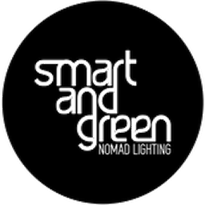

<p align="center">
  
</p>

<h1 align="center">Smart &amp; Green Cube — Home Assistant Integration</h1>

<p align="center">
  Lokale Steuerung der <b>Smart &amp; Green „Cube"</b>-Leuchten (BLE-RGBW, Linkio-LMP)
  direkt aus Home Assistant – ohne Cloud, ohne Hersteller-Gateway.
</p>

<p align="center">
  
  
  
</p>

<p align="center"><a href="README.md">English version</a></p>

---

Die Integration spricht das proprietäre **LMP (Linkio Mesh Protocol)** der App
„Smart & Green – Mesh" direkt über BLE. Die nötigen Mesh-Schlüssel liest sie
**einmalig aus dem verschlüsselten App-Export (`.lap`)** – kein Hex-Gefummel.
Die Steuerung läuft über den Bluetooth-Adapter des HA-Hosts oder einen
**ESPHome-Bluetooth-Proxy** in Funkreichweite der Cubes.

> Reverse-engineered für die private Interoperabilität eigener, gekaufter Hardware.
> Kein offizielles Produkt von Smart & Green / Linkio. Alle Marken gehören ihren Eigentümern.

## Features

- Ein `light`-Entity pro Cube: **An/Aus, Helligkeit, Farbe (HS), Farbtemperatur**
- **Quittierte Befehle** — der Cube bestätigt jeden Schaltvorgang, verlorene
  werden erkannt und wiederholt
- **Zustand übersteht Neustarts** (gespeicherter Zustand statt „alles aus")
- Optionales Gruppen-Entity **„Alle"** — ein Broadcast erreicht über das Mesh
  alle Cubes und braucht nur *eine* Verbindung, ist also deutlich schneller als
  einzelnes Schalten
- **Diagnosesensoren** je Cube: Signalstärke, zuletzt gesehen, verwendeter Proxy
- Transparente Nutzung vorhandener **ESPHome-Bluetooth-Proxys**
- **Auto-Discovery** der Cubes per BLE-Advertisement (Company-ID `0x04AA`)
- Schlüssel-Import direkt aus dem `.lap`-Export der App

### Warum der erste Druck lange dauert

Die Cubes werben nur etwa **alle 50 Sekunden** (im Feld gemessen). Eine
BLE-Verbindung kann erst beginnen, wenn der Proxy ein solches Advertisement
gehört hat — ein kalter Verbindungsaufbau wartet daher im Mittel eine halbe,
schlimmstenfalls eine ganze Werbeperiode. Das ist Stromsparen in der Firmware
und lässt sich nicht wegprogrammieren.

Was die Integration tut, damit es nicht stört:

- Die Anzeige schaltet **sofort** um, gesendet wird im Hintergrund — man muss
  nicht mehrfach drücken. Bestätigt der Cube den Befehl nicht, wird die Anzeige
  nachträglich zurückgesetzt.
- Die Verbindung bleibt **zwei Minuten** offen, damit Folgebefehle das
  Werbeintervall nicht erneut bezahlen.
- LMP ist ein Mesh: **jede** offene Verbindung kann einen Befehl an **jeden**
  Cube weiterreichen. Ist ein Cube bereits verbunden, laufen Befehle für den
  anderen darüber und sparen die Wartezeit komplett — genauso arbeitet die
  Hersteller-App.
- Schnelle Änderungen (Ziehen am Regler) werden zusammengefasst.

### Reichweite beachten

Die Cubes sind BLE-Geräte mit kleiner Antenne. Unter **−75 dBm** wird die
Verbindung unzuverlässig: Sie kommt oft noch zustande, bricht dann aber während
der Service-Discovery ab — das sieht wie ein sporadischer Softwarefehler aus,
ist aber schlicht Funkreichweite. Fünf Meter durch eine massive Wand reichen
erfahrungsgemäß **nicht**.

Der Sensor **Signalstärke** zeigt den aktuellen Wert, und unter −75 dBm warnt
die Integration im Protokoll. Abhilfe ist immer ein Bluetooth-Proxy näher am
Cube — Home Assistant wählt automatisch den mit dem besten Empfang.

### Was es (noch) nicht gibt

- **Kein Rücklesen von An/Aus und Farbe.** Der Zustand steht weder im
  Advertisement (dort nur der Netzwerkzustand), noch beantwortet die Firmware
  eine Abfrage: `DEVICE_DATA_GET` (0x42) wird mit einem undokumentierten Code
  abgelehnt. Die App bekommt den Zustand offenbar als Ereignis
  (`LMP_EVENT_DEVICE_DATA`, 0x92) — im Test war keines auszulösen. Der Zustand
  in Home Assistant ist deshalb *optimistic* (`assumed_state`).

  Dafür wird jeder Befehl **quittiert**: Der Cube bestätigt mit `STATUS_ACK`,
  ob er ihn ausgeführt hat. Ein verlorener Befehl fällt damit sofort auf und
  wird wiederholt, statt still zu scheitern.
- **Kein Akkustand.** Obwohl es Akkuleuchten sind, beantwortet die Firmware die
  Abfrage nicht: `LMP_COMMAND_MODULE_BATTERY_STATUS_GET` (0x2D) wird mit
  `LMP_ERR_NOT_SUPPORTED` quittiert, `0x2C` bleibt unbeantwortet, und die
  Antwort auf `MODULE_INFO_GET` enthält kein Akkufeld. Am Gerät geprüft mit
  Firmware 2.9.0 / API 4.

## Voraussetzungen

- Home Assistant **2024.4+** mit aktiver **Bluetooth**-Integration
- Bluetooth-Adapter am HA-Host **oder** ein ESPHome-Gerät mit
  `bluetooth_proxy` (aktive Verbindungen) in Reichweite der Cubes
- Cubes im PRIVATE-Key-Modus (Standard der App)

## Installation

**Über HACS (Custom Repository):**

1. HACS → Integrationen → ⋮ → *Benutzerdefinierte Repositories*
2. `https://github.com/benji2k2/ha_smart_and_green` als Kategorie **Integration** hinzufügen
3. „Smart & Green Cube" installieren → Home Assistant neu starten

**Manuell:** Ordner `custom_components/smartgreen_cube/` nach
`<config>/custom_components/` kopieren und HA neu starten.

## Einrichtung

1. In der **Smart-&-Green-App** die Konfiguration exportieren
   (erzeugt eine passwortgeschützte `.lap`-Datei) und aufs HA-Gerät bringen.
2. In HA: *Einstellungen → Geräte & Dienste → Integration hinzufügen →
   „Smart & Green Cube"*.
3. **„Konfigurationsdatei (.lap) importieren"** wählen, Datei hochladen und das
   **Export-Passwort** eingeben.
4. Die Integration entschlüsselt die Datei, liest Schlüssel + Cube-/Gruppenliste
   und legt die Lampen automatisch an.

Kein Export zur Hand? Über **„Schlüssel manuell eingeben"** lassen sich
`keyCrypt1` und `nounceAESCrypt` (je 16 Byte Hex) direkt eintragen; die Cubes
werden dann per BLE-Scan gefunden.

## Wie es funktioniert (Kurzfassung)

Kein Bluetooth-SIG-Mesh, sondern **LMP** von Linkio SAS. Steuer-Frames gehen als
GATT-Write auf Characteristic `00005002-0000-1000-8000-00805f9b34fb`
(Service `41c15000-…`). Der 16-Byte-Payload wird mit
`payload XOR AES128-ECB(keyCrypt1, nonce)` verschlüsselt. Das Motiv des
Integrations-Icons stammt aus der Original-App (RGBW-„Cube").

## Status

Protokoll, Verschlüsselung, Frame-Format und Advertisement-Aufbau sind **am
echten Gerät verifiziert**, ebenso die Steuerung im Alltag (An/Aus, Helligkeit,
Farbe, Farbtemperatur) über einen ESPHome-Proxy und der Gruppen-Broadcast an
`FF:FF`. Der Zustand ist *optimistic* — siehe „Was es (noch) nicht gibt".
Rückmeldungen/Issues willkommen.

## Sicherheit / Datenschutz

Die `.lap`-Datei und der extrahierte Schlüssel (`keyCrypt1` + `nonce`) sind
**Geheimnisse deiner Installation**. Sie werden **nie** in dieses Repository
committed (siehe `.gitignore`).

**Speicherung in Home Assistant:** Der Schlüssel wird – wie alle
Integrations-Geheimnisse in HA (WLAN-Passwörter, Tokens, API-Keys) – in der
Config-Entry unter `<config>/.storage/core.config_entries` als **Klartext-JSON**
abgelegt. Home Assistant verschlüsselt diese Daten **nicht** at-rest; das
Bedrohungsmodell setzt einen vertrauenswürdigen Host voraus.

Praktisch bedeutet das:

- Wer Dateisystem-Zugriff auf den HA-Host hat, kann den Schlüssel lesen.
- Der Schlüssel landet in **Backups** – aktiviere daher **verschlüsselte Backups**.
- Der Schlüssel wird nie geloggt und in **Diagnose-Downloads maskiert**
  (`diagnostics.py`).

Einordnung: Es handelt sich um ein **lokales BLE-Steuergeheimnis** – missbrauchbar
nur in Funkreichweite bzw. über dein Proxy-Netz, nicht als Cloud-Zugang. Derselbe
Schlüssel liegt ohnehin bereits im App-Export, auf dem Smartphone und in den Cubes.

## Tests

```bash
python3 tests/run.py
```

Keine Home-Assistant-Installation nötig, siehe [tests/README.md](tests/README.md).

## Icons

Das Integrations-Icon liegt im Repo unter
`custom_components/smartgreen_cube/brand/` (`icon.png` 256px, `icon@2x.png` 512px,
`logo.png`). Das Motiv ist das Herstellerlogo aus der Original-App.

## Lizenz

MIT – siehe [LICENSE](LICENSE).
